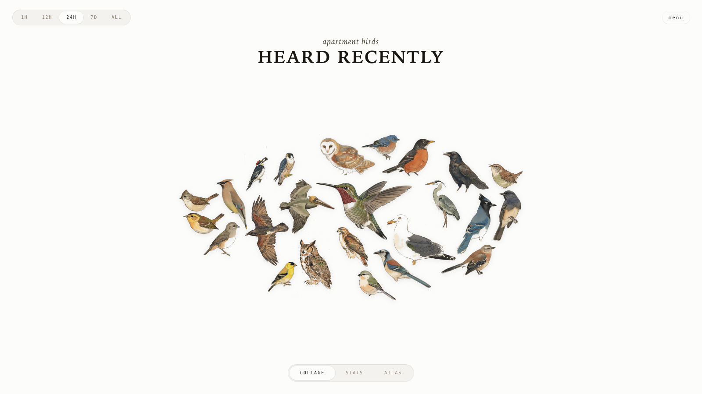

# AvianVisitors

*A live bird collage from your window.*

See it running at [bird.onethreenine.net](https://bird.onethreenine.net).



---

## BOM

| Qty | Description | Price | Link |
|-----|-------------|-------|------|
| 1 | Raspberry Pi (4B / 5 / Zero 2W) | ~$35-80 | [Raspberry Pi](https://www.raspberrypi.com/products/) |
| 1 | Micro SD Card (≥32 GB) | ~$10 | [Amazon](https://a.co/d/08aiL8c) |
| 1 | USB lavalier microphone | $14.99 | [Amazon](https://www.amazon.com/dp/B0176NRE1G) |
| 1 | Pi power supply | ~$10 | - |

Optional: a [Gemini API key](https://aistudio.google.com/apikey) to restyle illustrations, an [eBird API key](https://ebird.org/api/keygen) to filter species by region.

---

## 1. Flash the SD card

Use [Raspberry Pi Imager](https://www.raspberrypi.com/software/). Pick Raspberry Pi OS Lite (64-bit). In the customisation dialog set:

- Username
- WiFi SSID + password
- Hostname: `birdnet`
- Enable SSH with password auth

Plug the USB mic into the Pi. Place the capsule in a window or mount it outside. Boot.

---

## 2. Run the installer

```bash
ssh <your-username>@birdnet.local
curl -s https://raw.githubusercontent.com/Twarner491/AvianVisitors/avian-visitors/newinstaller.sh | bash
```

Clones this fork, installs BirdNET-Pi, symlinks the AvianVisitors overlay into the Caddy web root. Takes 20-40 minutes. Reboots when done.

Collage: `http://birdnet.local/avian/`. Stock BirdNET-Pi UI: `http://birdnet.local/`.

---

## 3. (Optional) Restyle the illustrations

The repo ships with 450 bundled illustrations. To restyle or add region-specific species:

```bash
export GEMINI_API_KEY='your-key'

# Re-render every species in BirdNET-Pi's model:
python3 ~/BirdNET-Pi/avian/scripts/pregen.py --labels ~/BirdNET-Pi/model/labels.txt --force

# Or filter to species observed in your eBird region:
export EBIRD_API_KEY='your-key'
python3 ~/BirdNET-Pi/avian/scripts/pregen.py \
  --labels ~/BirdNET-Pi/model/labels.txt \
  --ebird-region US-CA
```

Style lives in [`avian/scripts/prompt.template.md`](avian/scripts/prompt.template.md). Edit, re-run with `--force`.

---

## 4. (Optional) Forward off your LAN

See [`avian/forwarding/`](avian/forwarding/) for three independent recipes:

- **Cloudflare Tunnel** for a public HTTPS URL.
- **Home Assistant REST sensor** that exposes the latest detection.
- **MQTT bridge** that publishes every new detection.

---

## Repo layout

```
avian/                  # everything we add to BirdNET-Pi
├── frontend/           # static HTML/JS/CSS for the collage
├── assets/             # 450 bundled illustrations + cutouts + masks
├── api/                # PHP shims served by BirdNET-Pi's PHP-FPM
├── scripts/            # pregen.py + editable prompt template
└── forwarding/         # optional HA / MQTT / Cloudflare configs
```

Everything outside `avian/` is upstream BirdNET-Pi.

---

## License

CC-BY-NC-SA-4.0, inherited from [BirdNET-Pi](https://github.com/Nachtzuster/BirdNET-Pi/blob/main/LICENSE). Non-commercial use only. See the [BirdNET-Pi README](https://github.com/Nachtzuster/BirdNET-Pi/blob/main/README.md) for full Cornell attribution.

---

- [Fork this repository](https://github.com/Twarner491/AvianVisitors/fork)
- [Watch this repo](https://github.com/Twarner491/AvianVisitors/subscription)
- [Create issue](https://github.com/Twarner491/AvianVisitors/issues/new)
